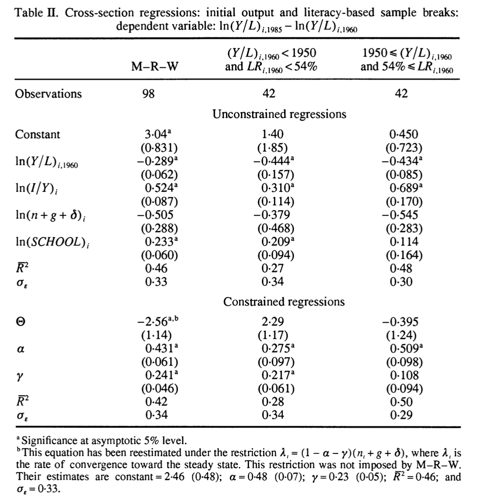

```{r setup, include=FALSE}
knitr::opts_chunk$set(echo = TRUE)
```

## Introduccion

Durlauf y Johnson (1995) investigan el crecimiento través de paises usando el  modelo de crecimiento de Solow extendido de  MRW (1992)


## Modelo

Parten asumiendo que el producto agregado del pais $i$ en el periodo $t$, $Y_{it}$ sigue una función Cobb Douglas


\begin{equation}
Y_{it} = \phi K_{it}^\alpha H_{it}^\gamma (A_t L_{it}^{1-\alpha-\gamma})
\end{equation}

Las ecuaciones de acumulación de capital son:


\begin{equation}
\frac{dK_{it}}{dt} = s_i^kY_{it} - \delta K_{it}
\end{equation}


\begin{equation}
\frac{dH_{it}}{dt} = s_i^hY_{it} - \delta H_{it}
\end{equation}

Esto implica que el cambio de producto entre $T$ y $T + \tau$ por trabajador esta dado por


\begin{equation}
\ln \left(\frac{Y}{L}\right)_{iT+\tau}-\ln \left(\frac{Y}{L}\right)_{iT}=\xi + \beta \ln \left(\frac{Y}{L}\right)_{iT} + \Pi X_i + \epsilon_i
\end{equation}


donde $X_i=(\ln( s_i^h), \ln( s_i^k),\ln(n_i+g+\delta)$ . ($g$ es la tasa de crecimiento de la tecnología, $\delta$ la tasa de depreciación de $K$, $n$ tasa de crecimiento de $L$)


## Data

Las variables en la regression son:

  - GDP per member of working-age population, $Y/L$ (separately for 1960 and 1985); 
  - fraction of real GDP devoted to investment, $I/Y$ (annual average 1960--1985); 
  - growth rate of working-age population, $n$ (annual average 1960--1985);
  - fraction of working-age population enrolled in secondary school, $\mathit{SCHOOL}$ (annual average 1960--1985); 
  - the adult literacy rate, $\mathit{LR}$ in 1960.


```{r data, echo=FALSE, message=FALSE, warning=FALSE, results='asis'}

## read data
DJ <- read.table("../data/data.dj", header = TRUE, na.strings = c("-999.0", "-999.00"))

require("stargazer", quietly = TRUE)

stargazer(DJ, type="text", header=FALSE)

```

Gdp60 tiene media 3,681 y varianza..

## Regressions


```{r}
plot(log(DJ$GDPGRO),log(DJ$GDP60))
```


```{r regs, echo=FALSE, message=FALSE, warning=FALSE, results='asis'}
library("lmtest")
library("sandwich")

## use only non-oil countries
dj <- subset(DJ, NONOIL == 1)
## rescale only population growth
dj$POPGRO <- dj$POPGRO/100

## model equation (taken from MRW, Table V)
dj_model <-  I(log(GDP85) - log(GDP60)) ~ log(GDP60) + log(IONY) + log(POPGRO + 0.05) + log(SCHOOL)
## but MRW used different scaling
mrw_model <- I(log(GDP85) - log(GDP60)) ~ log(GDP60) + log(IONY/100) + log(POPGRO + 0.05) + log(SCHOOL/100)

## Table II
dj_mrw <- lm(mrw_model, data = dj)
dj_sub1 <- lm(dj_model, data = dj, subset = GDP60 < 1800 & LIT60 < 50)
dj_sub2 <- lm(dj_model, data = dj, subset = GDP60 >= 1800 & LIT60 >= 50)

robust_se<-lapply(list(dj_sub1,dj_sub2), function(x) sqrt(diag(vcovHC(x, type = "HC0"))))
  
stargazer(dj_mrw,
          dj_sub1,
          dj_sub2,
          title="Reproducción Table II",
          type = "latex",
          float = TRUE,
          report = "vcs*",
          se= list(NULL, robust_se[[1]],robust_se[[2]]),
          no.space = TRUE,
          header=FALSE,
          single.row = FALSE,
          font.size = "small",
          intercept.bottom = F,
          digits = 3,
          t.auto = F,
          p.auto = F,
          omit.stat=c("f")
          )
```

